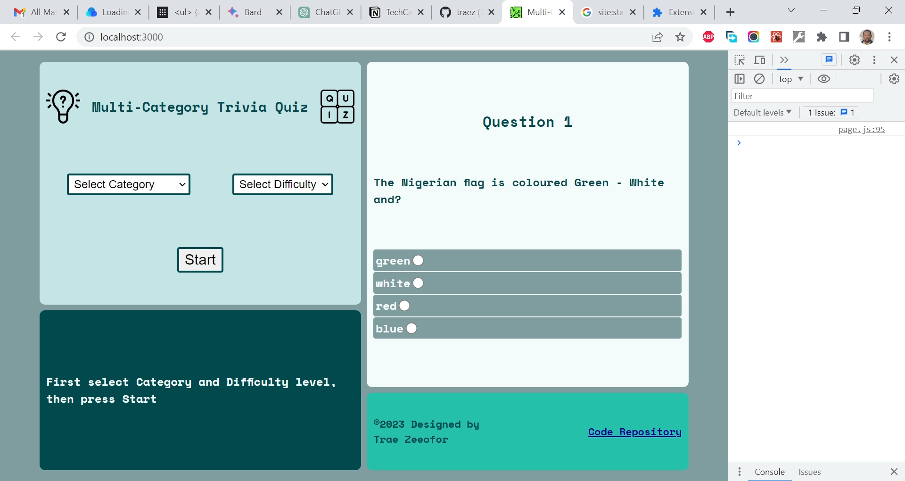

# Khushi Bhambri - Quiz App Project Using Fetch API and Javascript

This is a solution to the [Quiz App Project suggestion using Fetch API and Javascript](https://plainenglish.io/blog/top-beginner-friendly-projects-using-apis-f43356aeac7f). I am trying to improve my coding skills by building realistic projects.

## Table of contents

- [Overview](#overview)
  - [The challenge](#the-challenge)
  - [Screenshot](#screenshot)
  - [Links](#links)
- [My process](#my-process)
  - [Built with](#built-with)
  - [What I learned](#what-i-learned)
  - [Continued development](#continued-development)
  - [Useful resources](#useful-resources)
- [Author](#author)
- [Acknowledgments](#acknowledgments)

## Overview

### The challenge

- The objective of this project is to make something interactive for users, A Quiz App! Where initially the user can choose the Quiz Topic and difficulty. 

### Screenshot

### Links

- Solution URL: [https://github.com/traez/multi-category-trivia-quiz](https://github.com/traez/multi-category-trivia-quiz)
- Live Site URL: [https://multi-category-trivia-quiz-traez.vercel.app](https://multi-category-trivia-quiz-traez.vercel.app)

## My process

### Built with

- Semantic HTML5 markup
- CSS custom properties
- Flexbox
- CSS Grid
- Mobile-first workflow
- [React](https://reactjs.org/) - JS library
- [Next.js](https://nextjs.org/) - React framework

### What I learned

1. When your coding logic flow is not sequential. Even chatGPT fit no save you. Lols. Write clean code, and do so in order. First actions written first etc.   

### Continued development

More Next.js projects. GraphQL projects too in the longer term.

### Useful resources

Stackoverflow  
YouTube  
Google  
ChatGPT  

## Author

- Website - [Trae Zeeofor](https://github.com/traez)  
- Twitter - [@trae_z](https://twitter.com/trae_z) 

## Acknowledgments

Happy father's day to all men of good stature.
